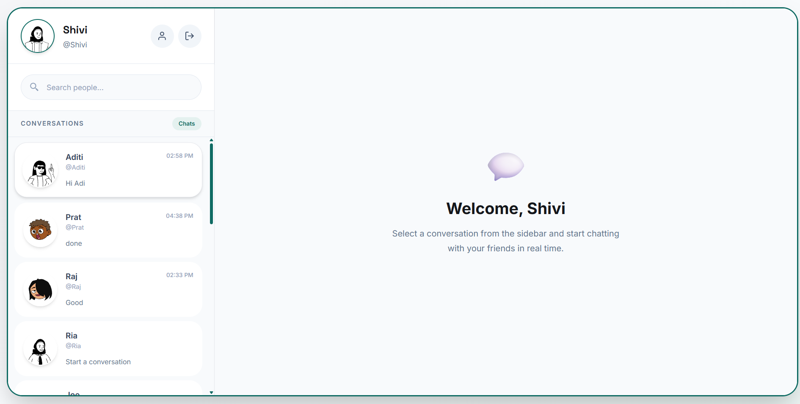
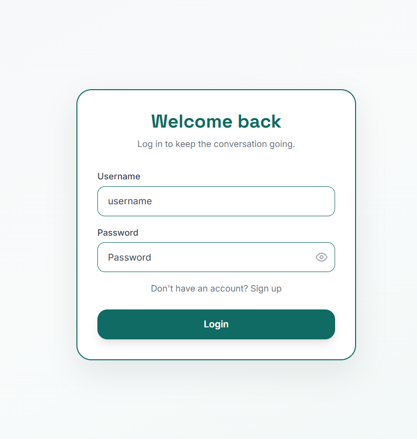
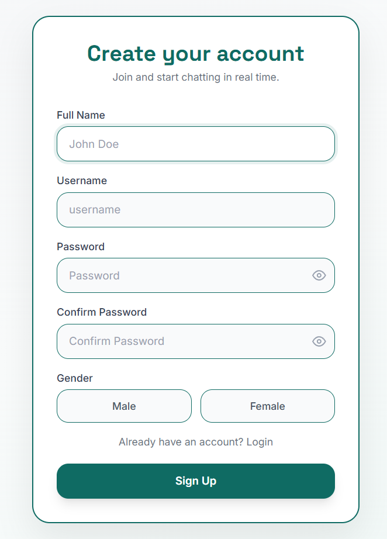
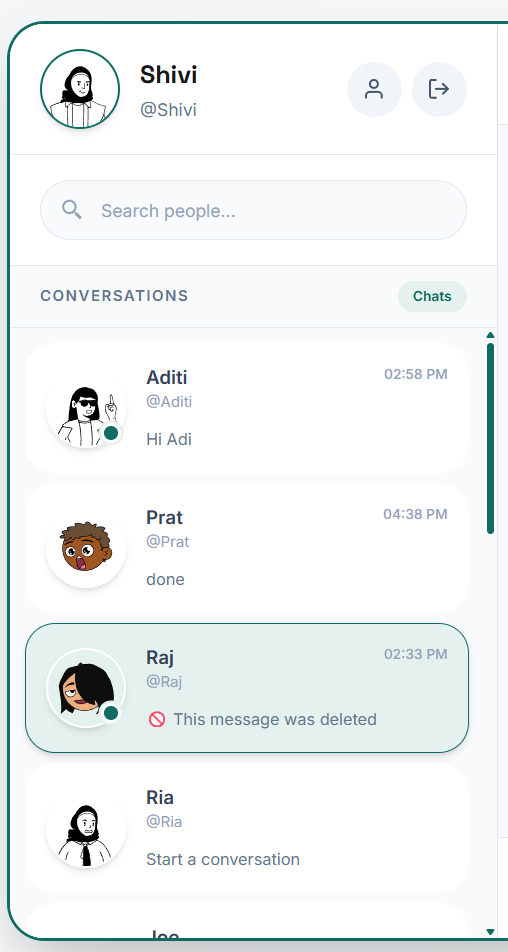
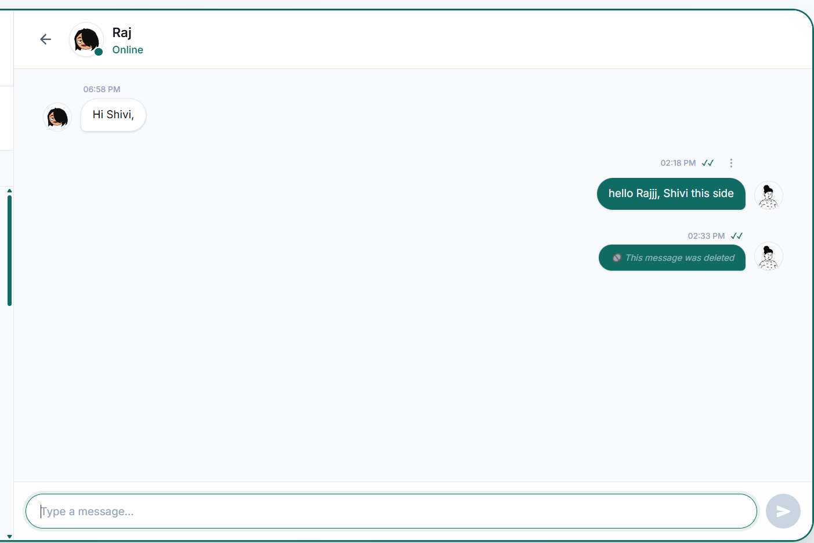
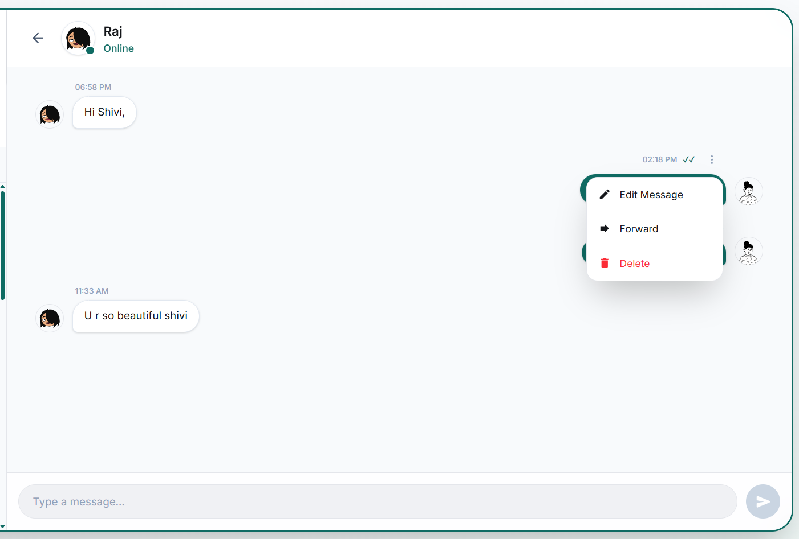
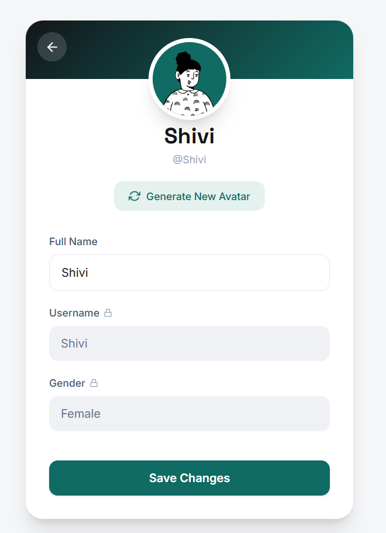
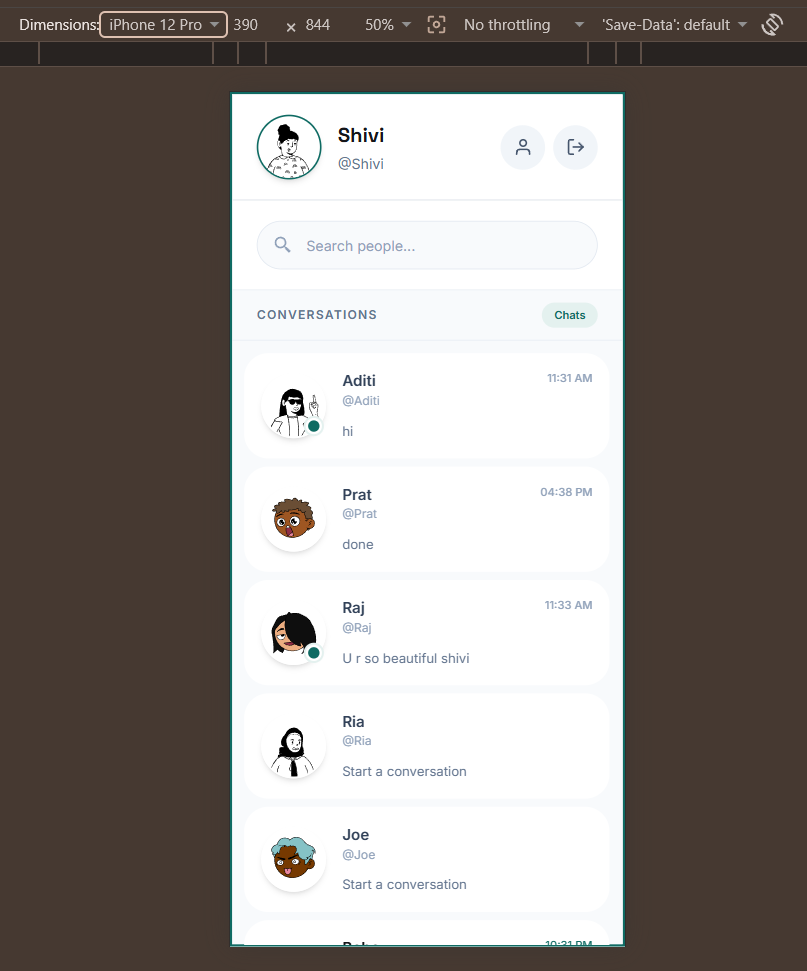
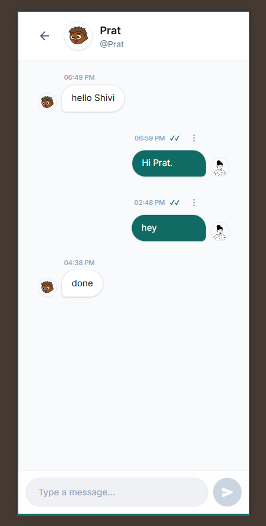

# 💬 Connectify

> A modern full-stack real-time chat application built using the MERN Stack with secure authentication, real-time messaging, Socket.IO, and a responsive user interface.



## 🌐 Live Demo

**Frontend:** https://connectify-iota-five.vercel.app

**Backend API:** https://connectify-5q6s.onrender.com

## 📖 Project Overview

Connectify is a real-time messaging application developed as an MCA Final Year Project.

The application allows users to register, log in securely, exchange real-time messages, edit and delete messages, forward messages, update their profile, view online users, and receive typing indicators.

The project follows a modern MERN architecture with React on the frontend, Express and Node.js on the backend, MongoDB Atlas as the database, Socket.IO for real-time communication, and Redux Toolkit for state management.

## ✨ Features

### 🔐 Authentication
- Secure user registration and login using JWT authentication.
- Passwords are securely hashed using bcrypt.
- Authentication is maintained using HTTP-only cookies.
- Protected routes prevent unauthorized access.

### 💬 Real-Time Messaging
- One-to-one real-time chat using Socket.IO.
- Instant message delivery without refreshing the page.
- Automatic conversation creation for new chats.
- Live conversation preview updates in the sidebar.

### 📝 Message Management
- Send and receive messages instantly.
- Edit previously sent messages.
- Delete messages for everyone.
- Delete messages only for yourself.
- Forward messages to multiple users.

### 👤 User Features
- Update profile name.
- Generate a new avatar.
- View all registered users.
- Search users by name.

### 🟢 Presence & Activity
- Real-time online/offline status.
- Typing indicator.
- Message seen status.
- Unread message counter.

### 🎨 User Interface
- Modern responsive design.
- Mobile-friendly layout.
- Clean chat interface.
- Skeleton loaders during data loading.
- Smooth animations and transitions.

### 🚀 Deployment
- Frontend deployed on Vercel.
- Backend deployed on Render.
- MongoDB Atlas used as the cloud database.

## 🛠️ Tech Stack

### Frontend
- React 19
- Vite
- Tailwind CSS
- Redux Toolkit
- Redux Persist
- React Router DOM
- Axios
- React Hot Toast
- React Icons
- Socket.IO Client

### Backend
- Node.js
- Express.js
- Socket.IO
- JWT (JSON Web Token)
- bcryptjs
- Cookie Parser
- CORS

### Database
- MongoDB Atlas
- Mongoose

### Deployment
- Vercel (Frontend)
- Render (Backend)
- MongoDB Atlas (Database)

### Development Tools
- Git & GitHub
- Visual Studio Code
- Postman

## 📸 Project Screenshots

### 🔐 Login Page

Secure login interface with JWT authentication.



---

### 📝 Registration Page

Create a new account with profile avatar generation.



---

### 🏠 Home Dashboard

Sidebar with user profile, search functionality, and conversation list.


---

### 📂 Sidebar

Search users, view online status, and access conversations.



---

### 💬 Chat Interface

Real-time messaging interface with modern responsive design.



---

### ⚙️ Message Actions

Edit, forward, and delete messages using the contextual menu.



---

### 👤 Profile Page

Update profile information and generate a new avatar.



---

### 📱 Mobile Responsive Layout

Optimized interface for mobile devices.

#### Home Screen



#### Chat Screen



## 📂 Project Structure

```
Connectify/
│
├── backend/
│   ├── config/
│   ├── controllers/
│   ├── middleware/
│   ├── models/
│   ├── routes/
│   ├── socket/
│   ├── package.json
│   └── index.js
│
├── frontend/
│   ├── public/
│   ├── src/
│   │   ├── components/
│   │   ├── Hooks/
│   │   ├── redux/
│   │   ├── utils/
│   │   ├── api/
│   │   ├── App.jsx
│   │   └── main.jsx
│   ├── package.json
│   └── vite.config.js
│
├── screenshots/
├── README.md
└── .gitignore
```

## ⚙️ Installation

### Clone the Repository

```bash
git clone https://github.com/<YOUR_GITHUB_USERNAME>/<YOUR_REPOSITORY_NAME>.git
cd <YOUR_REPOSITORY_NAME>
```

### Backend Setup

```bash
cd backend
npm install
npm start
```

### Frontend Setup

```bash
cd frontend
npm install
npm run dev
```

The frontend will run on:

```
http://localhost:5173
```

The backend will run on:

```
http://localhost:9000
```

## 🔐 Environment Variables

### Backend (`backend/.env`)

```env
PORT=9000
MONGODB_URI=your_mongodb_connection_string
JWT_SECRET_KEY=your_secret_key
FRONTEND_URL=http://localhost:5173
```

### Frontend (`frontend/.env`)

```env
VITE_API_URL=http://localhost:9000/api/v1
VITE_SOCKET_URL=http://localhost:9000
```

## 📡 API Overview

### Authentication
| Method | Endpoint | Description |
|--------|----------|-------------|
| POST | `/api/v1/user/register` | Register a new user |
| POST | `/api/v1/user/login` | Login user |
| GET | `/api/v1/user/logout` | Logout user |

### Users
| Method | Endpoint | Description |
|--------|----------|-------------|
| GET | `/api/v1/user` | Get all other users |
| PATCH | `/api/v1/user/profile` | Update user profile |

### Messages
| Method | Endpoint | Description |
|--------|----------|-------------|
| GET | `/api/v1/message/:id` | Get conversation messages |
| POST | `/api/v1/message/send/:id` | Send a message |
| PATCH | `/api/v1/message/edit/:id` | Edit message |
| PATCH | `/api/v1/message/delete/:id` | Delete message |
| PATCH | `/api/v1/message/deleteforme/:id` | Delete message for current user |
| POST | `/api/v1/message/forward` | Forward message |

### Conversations
| Method | Endpoint | Description |
|--------|----------|-------------|
| GET | `/api/v1/conversation/sidebar` | Get sidebar conversations |
| PATCH | `/api/v1/conversation/:id/read` | Mark messages as read |

## 🚀 Deployment

| Service | Platform |
|---------|----------|
| Frontend | Vercel |
| Backend | Render |
| Database | MongoDB Atlas |

### Live Application

- **Frontend:** https://connectify-iota-five.vercel.app
- **Backend API:** https://connectify-5q6s.onrender.com

## 🔮 Future Improvements

- Group chat support
- Image and file sharing
- Voice and video calling
- Push notifications
- User status (Away, Busy, Offline)
- Emoji reactions
- Message search
- Chat backup and export
- End-to-end encryption
- Progressive Web App (PWA) support

## 👩‍💻 Author

**Aditi Gupta**

MCA Student

GitHub: https://github.com/https://github.com/Aditi-Gupta21

LinkedIn: https://linkedin.com/in/https://www.linkedin.com/in/aditi-gupta-b923aa284/

## 🙏 Acknowledgements

This project was developed as part of my MCA Final Year Project to demonstrate full-stack web development, real-time communication, secure authentication, and modern deployment practices using the MERN stack.